# User guide Head of Ops

Mengawasi operasional lintas cabang dan laporan riil. Pengaturan dan laporan non-riil tidak tersedia pada akses bawaan.

Cabang: Seluruh cabang. Pemegang otorisasi: ya. Edit stok awal: ya.

Ikuti cabang akun; gunakan sidebar desktop atau navigasi bawah mobile. Tombol Keluar mobile berada pada baris akun di bawah header. Screenshot menggunakan data demo setelah perbaikan.

## Login akun Head of Ops

Masuk ke POS Warung dengan akun Head of Ops, mengenali halaman yang terbuka, dan menangani kendala masuk.

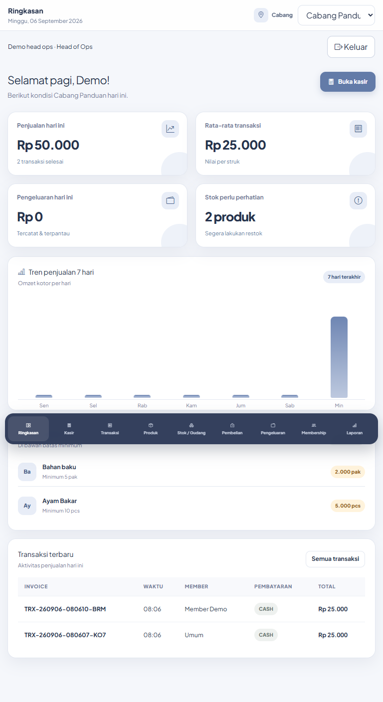
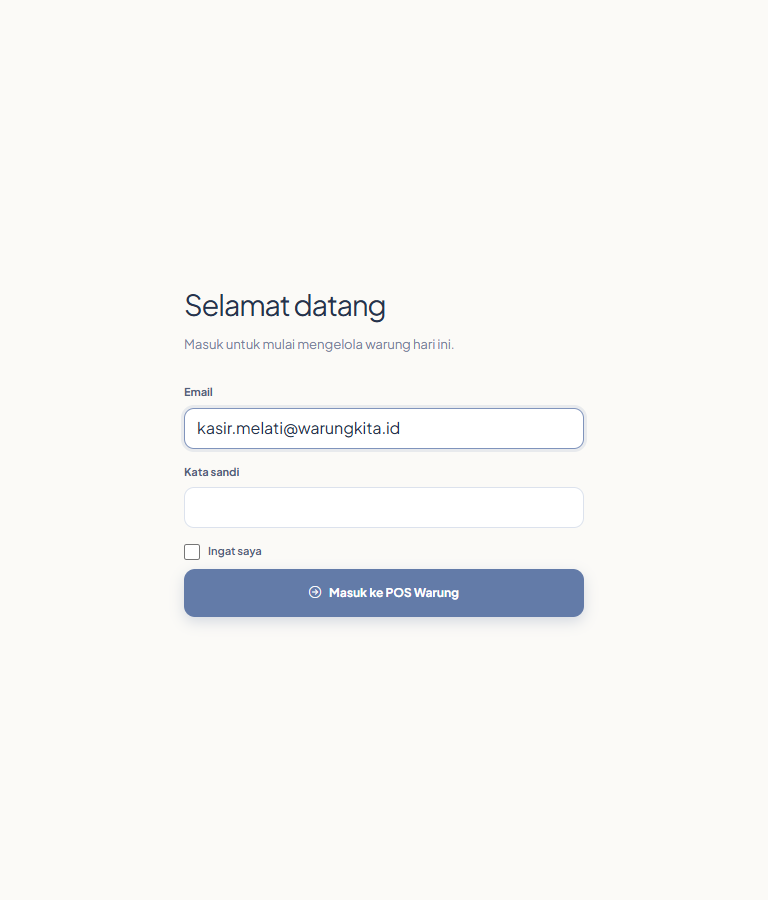
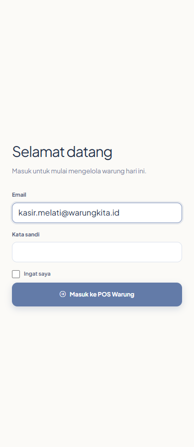

### Masuk ke aplikasi

1. Buka alamat POS Warung di Chrome atau Edge terbaru pada komputer, tablet, atau HP kasir. Gunakan alamat https bila tersedia agar kamera dan printer jaringan dapat dipakai.
2. Isi email akun dan kata sandi yang diberikan Superadmin/Developer. Huruf besar-kecil pada kata sandi berpengaruh.
3. Centang Ingat saya hanya pada perangkat milik outlet yang tidak dipakai bergantian dengan orang luar.
4. Klik Masuk POS Warung. Setelah berhasil, halaman Ringkasan langsung terbuka karena menu itu adalah menu pertama role Head of Ops.
5. Periksa nama dan role pada baris akun (sidebar bawah di desktop, di bawah judul pada tablet/mobile) serta cabang di kanan atas. Anda dapat berpindah cabang atau memilih Consolidated · Semua warung.

### Menu yang tersedia untuk Head of Ops

1. Menu bawaan: Ringkasan, Kasir dan tutup kasir, Reservasi, Transaksi, Produk dan kategori, Stok / Gudang, Pembelian, Pengeluaran, Membership dan deposit, Laporan.
2. Anda pemegang otorisasi. PIN otorisasi 4–8 digit (berbeda dari kata sandi) dipakai untuk menyetujui pembatalan, retur pengganti, koreksi deposit, dan tutup kasir. PIN diatur Superadmin melalui ikon kunci di Pengaturan → Akun.
3. Jika Superadmin mengubah master role, menu yang tampil mengikuti perubahan itu pada halaman berikutnya.

### Keluar dan kendala login

1. Keluar: desktop memakai ikon keluar di sidebar bawah; tablet/mobile memakai tombol Keluar di baris akun. Selalu keluar bila perangkat dipakai bergantian.
2. Pesan "Email atau kata sandi tidak sesuai": periksa ejaan email dan Caps Lock. Akun yang dinonaktifkan juga ditolak dengan pesan ini; hubungi Superadmin.
3. Setelah 10 kali gagal dalam satu menit, login dikunci sementara. Tunggu satu menit lalu coba lagi.
4. Pesan "Role akun ini sudah tidak berlaku": role akun dihapus atau diubah. Superadmin perlu memilihkan role yang aktif.
5. Lupa kata sandi: tidak ada reset mandiri. Minta Superadmin mengganti kata sandi melalui Pengaturan → Akun.

Hasil: Akun masuk ke halaman Ringkasan dengan menu dan cabang sesuai hak akses.

- Akun demo tidak lagi ditampilkan di halaman login. Gunakan akun yang dibuat untuk Anda.
- Jangan berbagi akun. Setiap transaksi, pembatalan, dan otorisasi tercatat atas nama akun yang dipakai.

## Setup awal (wizard)

Pada instalasi baru, halaman Warung belum siap digunakan muncul sampai Developer atau Superadmin menyelesaikan wizard Setup awal. Masuk kembali setelah setup selesai.

## Ringkasan

Memantau kondisi cabang hari ini melalui penjualan, rata-rata transaksi, pengeluaran, stok rendah, tren tujuh hari, dan transaksi terbaru.

### Membaca ringkasan

1. Pilih cabang pada bagian atas; untuk rekap lintas cabang pilih Consolidated · Semua warung.
2. Baca kartu penjualan, rata-rata per transaksi, pengeluaran, dan stok perlu perhatian.
3. Lihat tren tujuh hari dan daftar transaksi terbaru.
4. Gunakan Lihat semua untuk menuju Gudang atau Semua transaksi untuk menuju riwayat, apabila akses menu tersebut tersedia.

### Menindaklanjuti stok rendah

1. Periksa produk dan satuannya pada Perhatian stok.
2. Buka Gudang untuk memeriksa stok fisik, produksi, atau penyesuaian yang perlu dicatat. Stok sisa hari sebelumnya tersedia otomatis saat halaman stok dibuka.

Hasil: Ringkasan menampilkan informasi periode hari ini sesuai cakupan cabang. Perubahan cabang tidak memindahkan data transaksi.

- Menu ini menampilkan omzet. Hak akses default hanya Developer, Superadmin, dan Head of Ops.

## Kasir dan tutup kasir

Mencatat pesanan, menerima pembayaran, melanjutkan open bill, mencetak struk, dan melakukan rekonsiliasi kas harian.

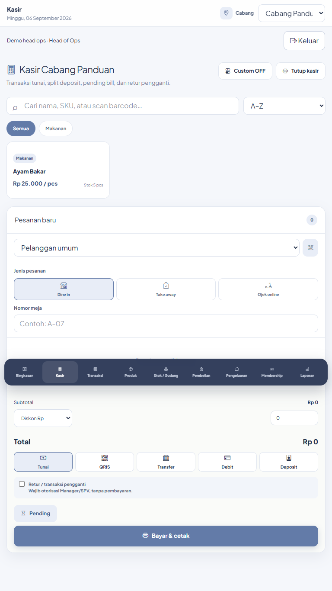

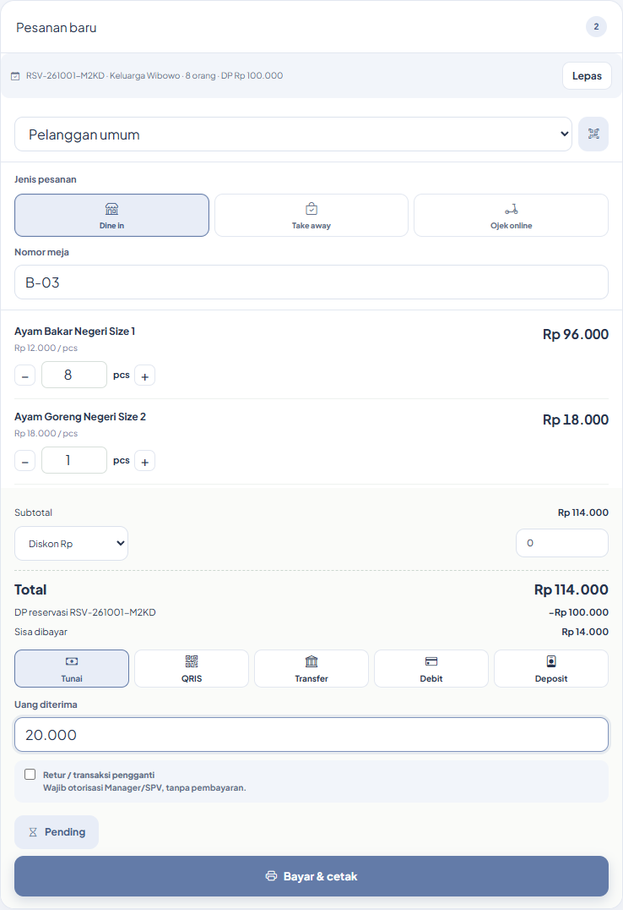

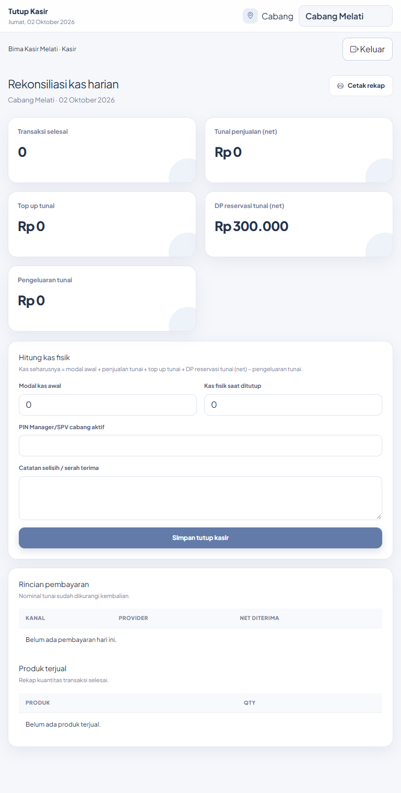

### Membuat pesanan

1. Pastikan nama cabang benar dan stok menu tersedia. Cari produk lewat nama, SKU/barcode, kategori, atau urutan harga/nama.
2. Klik produk untuk memasukkannya ke keranjang. Ubah jumlah pada kolom qty atau tombol +/−; periksa satuan pcs/gram.
3. Pilih Dine in dan isi nomor meja, Take away, atau Ojek online dan pilih platform. Harga online digunakan otomatis untuk pesanan online.
4. Pilih member dari daftar atau tombol scan jika diperlukan. Periksa nama, saldo, dan diskon sebelum meneruskan.
5. Periksa diskon Rp, diskon %, atau diskon member. Pastikan total dan jumlah produk benar.

### Membayar dan mencetak

1. Pilih Tunai, QRIS, Transfer, Debit, atau Deposit. Untuk QRIS/transfer/debit pilih bank atau provider penerima.
2. Tunai: masukkan uang yang benar-benar diterima. Contoh total Rp25.000, terima Rp30.000, maka kembalian Rp5.000. Input kosong atau kurang ditolak.
3. Deposit: pilih member. Anda dapat memakai seluruh tagihan atau sebagian saldo. Untuk split, isi deposit yang dipakai dan pilih kanal pelunasan; jika sisa dibayar tunai, isi nominal uang yang diterima.
4. Klik Bayar & cetak sekali. Tunggu proses selesai dan periksa struk. Stok berkurang dan saldo deposit terpakai dikurangi hanya ketika transaksi berhasil.
5. Jika struk belum tercetak, periksa Transaksi dan cetak ulang invoice yang sudah tersimpan sebelum membuat pesanan ulang.

### Menyimpan dan melanjutkan open bill

1. Susun pesanan lalu klik Pending. Bill tersimpan tanpa mengurangi stok.
2. Klik Open bill, pilih invoice, periksa lagi member, item, harga, dan stok.
3. Ubah pesanan lalu Pending untuk memperbarui bill yang sama; gunakan Bayar & cetak untuk menyelesaikannya.
4. Untuk membatalkan pending, gunakan tombol batal pada daftar Open bill dan isi alasan.

### Melayani tamu reservasi

1. Klik tombol Reservasi di atas Kasir (angka = reservasi hari ini dan tamu yang sudah datang), lalu pilih nama tamu.
2. Jenis pesanan otomatis Dine in dan nomor meja terisi. Banner reservasi tampil di atas keranjang; tombol Lepas membatalkan pilihan bila salah.
3. Masukkan pesanan. Ringkasan menampilkan DP reservasi (−) dan Sisa dibayar; terima pembayaran sebesar sisa lalu Bayar & cetak. Bila DP menutup seluruh total, kolom uang diterima tidak perlu diisi.
4. Langkah lengkap ada pada bagian Reservasi.

### Transaksi pengganti dan nominal custom

1. Retur/transaksi pengganti: centang opsi tersebut dan isi PIN Manager/SPV yang berwenang. Transaksi pengganti tidak menagih pembayaran, tetapi mengeluarkan stok barang pengganti.
2. Custom ON/OFF hanya dapat diatur oleh role pemegang otorisasi. Ketika diaktifkan, tombol Custom memungkinkan nama dan harga item manual yang tampil pada nota.

### Rekonsiliasi akhir hari

1. Klik Tutup kasir. Rekap berlaku untuk cabang dan tanggal hari ini.
2. Masukkan modal kas awal dan kas fisik yang dihitung; periksa penjualan tunai bersih, top up tunai, DP reservasi tunai (net), dan pengeluaran tunai.
3. Kas seharusnya = modal awal + penjualan tunai net + top up tunai + DP reservasi tunai (net) − pengeluaran tunai. DP tunai dihitung pada hari DP diterima; DP tunai yang dikembalikan hari itu sudah dikurangkan. Isi catatan selisih/serah terima.
4. Jika akun bukan pemegang otorisasi, isi PIN Manager/SPV yang berwenang untuk cabang aktif. Klik Simpan tutup kasir dan periksa selisih.
5. Catatan tutup kasir yang sudah tersimpan hanya dapat diperbarui oleh pemegang otorisasi. Gunakan Cetak rekap bila diperlukan.

Hasil: Invoice selesai tercatat bersama pembayaran; struk customer dan salinan dapur tersedia. Tutup kasir menyimpan rekonsiliasi harian, bukan mengunci seluruh transaksi berikutnya.

- PIN hanya diterima dari akun aktif yang berwenang atas cabang tersebut.
- Kamera dan printer perlu dicoba di perangkat operasional; panduan ini tidak menggantikan uji fisik.

## Reservasi

Mencatat reservasi meja dan DP tamu, memantau jadwal per tanggal, lalu memotong DP di Kasir saat tamu datang.

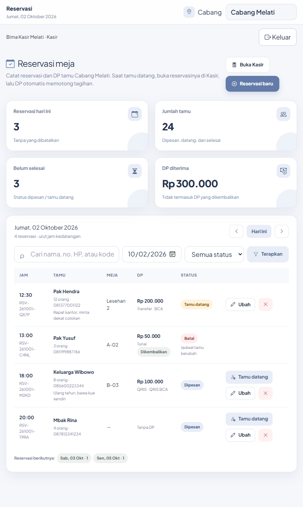
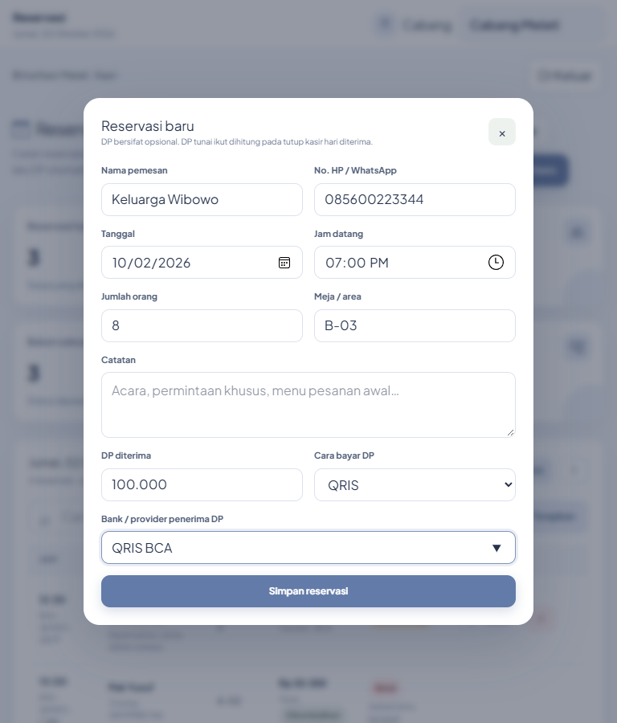
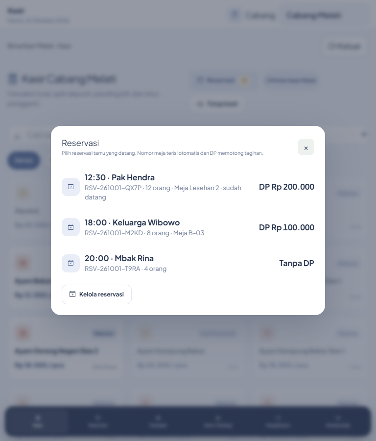

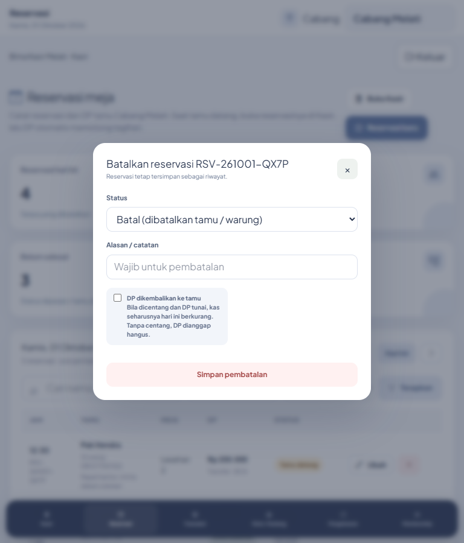
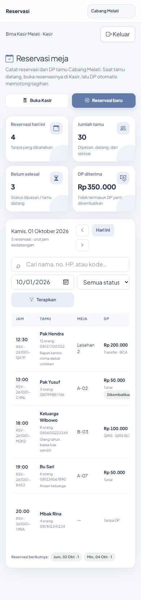

### Mencatat reservasi baru

1. Pastikan cabang di kanan atas benar; reservasi hanya terlihat di cabang tempat dicatat.
2. Buka Reservasi di sidebar (mobile: navigasi bawah), lalu klik Reservasi baru.
3. Isi nama pemesan, No. HP/WhatsApp, tanggal, jam datang, jumlah orang, serta meja/area bila sudah ditentukan. Gunakan Catatan untuk acara atau permintaan khusus.
4. Bila tamu membayar DP, isi nominal dan cara bayarnya (Tunai, QRIS, Transfer, Kartu debit). Selain tunai, isi bank/provider penerima. Kosongkan bila tanpa DP.
5. Klik Simpan reservasi. Sistem memberi kode RSV-…; sampaikan kode itu kepada tamu sebagai bukti.

### Memantau jadwal

1. Daftar menampilkan reservasi satu tanggal, urut jam datang. Gunakan tombol ‹ Hari ini › atau pilih tanggal lalu Terapkan.
2. Saring status (Dipesan, Tamu datang, Selesai, Batal, Tidak datang) atau cari nama, No. HP, atau kode.
3. Kartu ringkasan menunjukkan jumlah reservasi, jumlah tamu, reservasi yang belum selesai, dan DP yang diterima. Baris Reservasi berikutnya menunjukkan tanggal mendatang yang sudah terisi.

### Tamu datang dan membayar

1. Saat tamu tiba, klik Tamu datang (opsional; memilih reservasi di Kasir juga dapat langsung dilakukan).
2. Di Kasir, klik tombol Reservasi lalu pilih nama tamu. Jenis pesanan menjadi Dine in, nomor meja terisi, dan banner reservasi tampil di atas keranjang.
3. Masukkan pesanan. Ringkasan menampilkan DP reservasi (−) dan Sisa dibayar. Contoh: total Rp114.000, DP Rp100.000, sisa Rp14.000; tamu membayar tunai Rp20.000 sehingga kembalian Rp6.000.
4. Klik Bayar & cetak. Struk memuat baris DP · RSV-… dan kanal pelunasan; reservasi berubah menjadi Selesai dengan nomor invoice. Bila DP lebih besar dari total, sisa DP yang belum terpakai tercatat di daftar reservasi untuk diselesaikan secara operasional.
5. Pesanan boleh disimpan sebagai Pending. Reservasi ikut tersimpan pada open bill dan DP dipotong ketika bill dibayar.

### Mengubah, membatalkan, atau tidak datang

1. Klik Ubah untuk mengganti jadwal, meja, jumlah tamu, atau catatan. Nominal DP hanya dapat diubah pada hari DP diterima.
2. Klik tombol ×, pilih Batal (alasan wajib) atau Tidak datang. Centang DP dikembalikan bila uang DP dikembalikan kepada tamu; tanpa centang, DP tercatat hangus.
3. Reservasi yang masih terhubung ke open bill tidak dapat dibatalkan. Batalkan open bill di Kasir lebih dulu.

### DP pada tutup kasir

1. DP tunai dihitung ke kas pada hari DP diterima (kartu DP reservasi tunai (net) di halaman Tutup kasir). DP tunai yang dikembalikan hari itu mengurangi kas seharusnya.
2. Saat tamu membayar, bagian DP tidak dihitung lagi sebagai tunai, sehingga kas tidak tercatat dua kali.
3. DP QRIS, transfer, atau debit tidak masuk laci kas; cocokkan dengan mutasi rekening atau aplikasi provider.

Hasil: Reservasi tercatat per cabang. DP memotong tagihan satu kali dan tampil di struk, rincian pembayaran laporan (kanal DP), serta tutup kasir.

- Membatalkan transaksi yang memakai DP mengembalikan reservasi ke status Tamu datang sehingga DP dapat dipakai lagi.
- Akses menu Reservasi dapat diatur Superadmin di Pengaturan → Master role (modul Reservasi). Secara bawaan semua role yang memiliki Kasir mendapat menu ini.

## Transaksi

Menelusuri invoice, mencetak ulang struk, dan membatalkan transaksi dengan jejak audit.

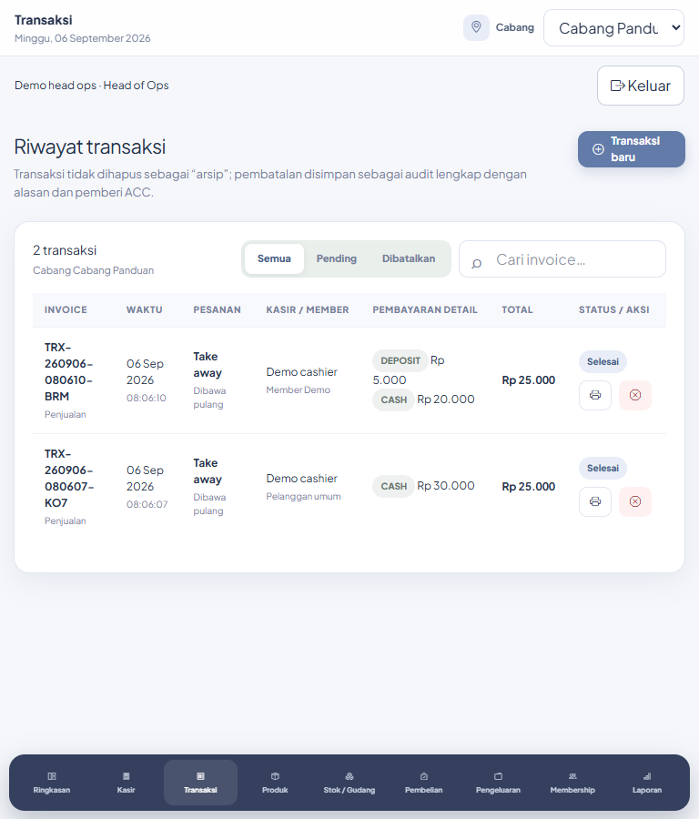

### Menemukan dan mencetak invoice

1. Buka Transaksi. Pilih Semua, Pending, atau Dibatalkan sesuai kebutuhan.
2. Cari invoice pada halaman aktif; gunakan paginasi untuk melihat catatan pada halaman lain. Pencarian di tabel ini memfilter baris halaman yang sedang ditampilkan.
3. Periksa waktu, pesanan, kasir/member, metode pembayaran, total, dan status.
4. Pada transaksi Selesai, klik ikon printer untuk membuka struk. Transaksi baru tersedia hanya jika akun juga memiliki menu Kasir.

### Membatalkan transaksi selesai

1. Klik ikon pembatalan pada invoice yang benar.
2. Isi alasan yang jelas, minimal lima karakter. Jika transaksi sudah lewat 30 detik, isi PIN Manager/SPV yang berwenang.
3. Konfirmasi pembatalan, lalu pastikan status menjadi Dibatalkan.
4. Periksa pemulihan stok dan deposit terkait. Invoice tetap tersimpan bersama alasan dan pemberi otorisasi. Pengembalian uang tunai/non-deposit di luar aplikasi tetap perlu diselesaikan secara operasional.

Hasil: Pembatalan mengubah status dan mencatat audit; transaksi tidak dihapus permanen.

- Untuk melanjutkan atau membatalkan bill Pending, gunakan Open bill di Kasir.
- Nominal pembayaran tunai pada riwayat dapat mencakup uang diterima sebelum kembalian; periksa struk untuk rincian kembalian.
- Pembayaran DP reservasi tampil sebagai DP · RSV-…. Membatalkan transaksi itu mengembalikan reservasi ke status Tamu datang sehingga DP dapat dipakai lagi.

## Produk dan kategori

Mengelola bahan baku, menu siap jual, harga, kategori, batas stok, serta arsip produk.

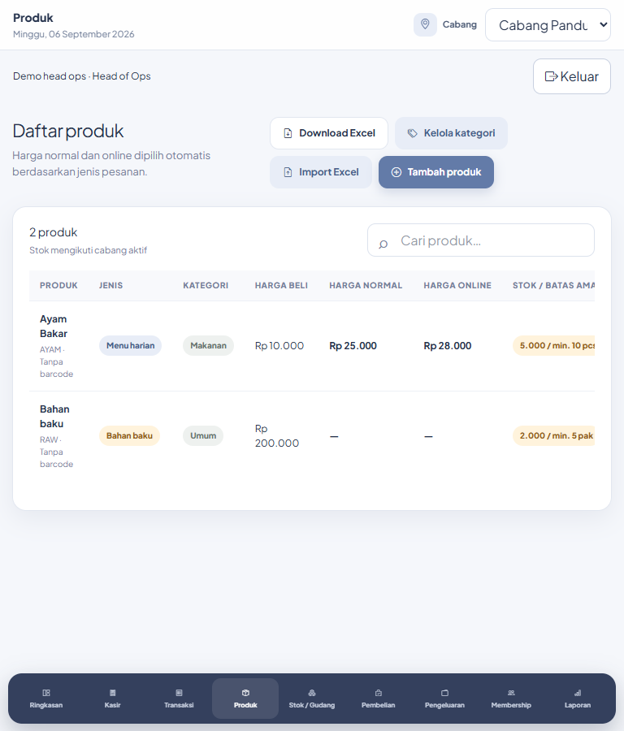

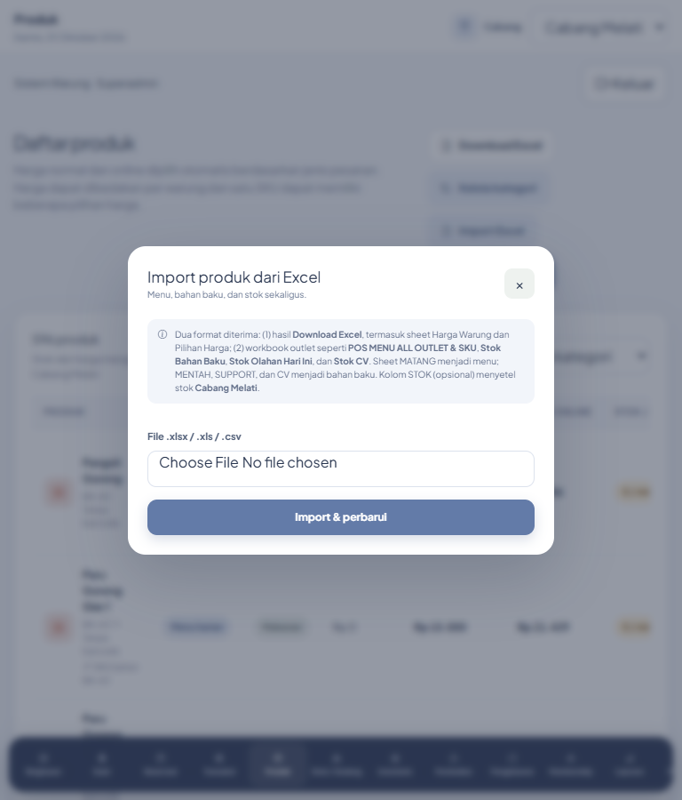

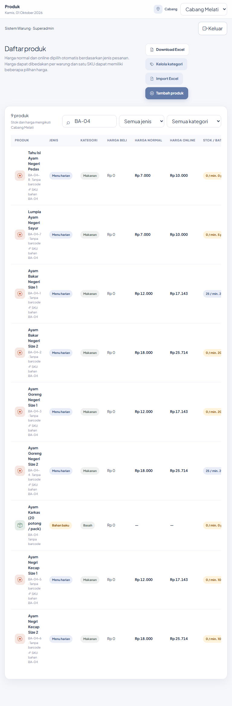

### Menambahkan produk

1. Klik Tambah produk. Isi nama dan jenis: menu siap jual memakai stok harian; bahan baku memakai stok gudang.
2. Isi SKU unik, barcode bila ada, kategori, dan satuan.
3. Masukkan harga beli, harga normal, harga online, stok awal, dan stok minimum; klik Simpan produk.
4. Periksa produk baru di tabel dan cabang aktif. Produk menu digunakan Kasir; bahan baku digunakan Pembelian/Produksi.

### Mengubah dan mengarsipkan

1. Gunakan ikon pensil untuk memperbarui data/harga produk; periksa kembali nilai sebelum Simpan perubahan.
2. Gunakan aksi arsip bila produk tidak dipakai. Produk arsip tidak tersedia sebagai produk aktif.
3. Untuk mengembalikan produk, cari bagian Arsip yang dapat dipulihkan lalu gunakan Pulihkan.

### Mengelola kategori

1. Klik Kelola kategori, isi nama dan warna, lalu Tambah kategori.
2. Perbarui nama/warna kategori pada tabel dan klik Simpan.
3. Kategori yang masih dipakai produk aktif tidak dapat diarsipkan. Pindahkan produk ke kategori lain sebelum mengarsipkannya.

### Impor dan ekspor

1. Klik Import Excel lalu pilih tab Format standar. Gunakan Download template untuk file kosong berisi sheet Petunjuk, atau Download data produk saat ini untuk mengubah data yang sudah ada.
2. Isi sheet Produk. Kolom wajib tampil langsung di bawah judul sheet (SKU, Nama, dan Harga Normal untuk menu); klik judul sheet untuk melihat semua kolom beserta keterangan dan contoh. Nilai Jenis menggunakan menu atau ingredient. Sheet Harga Warung dan Pilihan Harga bersifat opsional.
3. Klik kotak upload atau seret file ke kotak tersebut. Nama dan ukuran file tampil; file selain .xlsx/.xls/.csv atau di atas 5 MB langsung ditolak dengan pesan merah. Klik Import & perbarui; tombol berubah menjadi Mengunggah… sampai selesai. SKU yang sudah ada diperbarui (per jenis: menu atau bahan baku); SKU baru dibuat.
4. Periksa kembali hasil, harga, jenis produk, dan stok setelah impor. Jangan gunakan impor untuk menggantikan pencatatan mutasi stok harian.

### Upload menu & stok dari workbook outlet

1. Siapkan file dari tim pusat: POS MENU ALL OUTLET & SKU (sheet MATANG, MENTAH, SUPPORT, CV), atau file terpisah Stok Bahan Baku, Stok Olahan Hari Ini, dan Stok CV Samudera Pangan. Format tidak perlu diubah: baris 1 berisi judul kolom, baris kosong dilewati.
2. Pilih cabang tujuan di kanan atas. Menu, harga, dan kategori berlaku untuk semua cabang; stok ditulis ke cabang aktif.
3. Buka Produk → Import Excel, pilih tab Workbook outlet. Kolom wajib tiap sheet tampil langsung (MATANG: NAMA PRODUK, SKU, NOMINAL OFLINE; MENTAH/SUPPORT/CV: NAMA PRODUK, SKU). Klik judul sheet untuk daftar kolom lengkap, atau Download template untuk file kosong berisi sheet Petunjuk.
4. Seret file ke kotak upload atau klik untuk memilih, periksa nama file yang tampil, lalu klik Import & perbarui. File 600 produk selesai dalam beberapa detik.
5. Baca pesan hasil: jumlah menu dan bahan baku baru/diperbarui. Baris yang dilewati (nama/SKU kosong, harga tidak valid) tercantum pada kotak Catatan impor di atas daftar produk.
6. Sheet MATANG (atau file dengan kolom NOMINAL OFLINE) menjadi menu siap jual: NOMINAL OFLINE = harga normal, NOMINAL ONLINE = harga online (dibulatkan ke rupiah), MIN STOK = batas aman. Sheet MENTAH, SUPPORT, dan CV menjadi bahan baku. Kategori (Makanan, Snack, Minuman, Basah, Kering, Support, Gudang, Produksi) dibuat otomatis beserta ikon dan warnanya.
7. SKU bersama: pada workbook outlet, beberapa menu memakai SKU bahan bakunya (mis. BA-04 dipakai 8 menu Ayam Negeri). Menu seperti itu mendapat SKU sendiri BA-04-1, BA-04-2, dan seterusnya; SKU aslinya tampil sebagai "SKU bahan BA-04" dan tetap bisa dicari. Menu dan bahan baku boleh memakai SKU yang sama.
8. Impor ulang aman. Bahan baku dicocokkan lewat SKU, sedangkan menu lewat SKU dan nama, sehingga perubahan harga/nama memperbarui data yang ada tanpa menggandakan. Sel MIN STOK yang kosong tidak menghapus nilai lama.

### Upload jumlah stok dari Excel

1. Tambahkan kolom STOK (boleh juga STOK AWAL, STOK HARI INI, JUMLAH, QTY, atau SISA) pada file yang sama, lalu isi jumlah fisik per baris. Baris yang kolom stoknya kosong tidak mengubah stok.
2. Pilih cabang yang dihitung, lalu Import & perbarui seperti di atas.
3. Stok cabang aktif disetel ke angka tersebut dan dicatat sebagai stock opname berreferensi IMPORT-tanggal, sehingga selisihnya terlihat di riwayat pergerakan Stok / Gudang. Stok menu (olahan) berlaku untuk hari ini; stok bahan baku langsung menjadi saldo gudang.
4. Tanpa kolom stok, produk baru mulai dari stok 0. Isi melalui Stock opname, Pembelian, atau Produksi di Stok / Gudang.

Hasil: Master produk diperbarui. Penyesuaian stok operasional selanjutnya dicatat di Gudang.

- Kotak pencarian Produk mencari ke seluruh katalog (nama, SKU, SKU bahan, barcode); gunakan juga filter Jenis dan Kategori.
- Produk berlaku dalam tenant, sementara stok mengikuti cabang.

## Stok / Gudang

Mencatat pemakaian bahan, produksi, konsumsi, proses ulang, penyesuaian, serta opname.

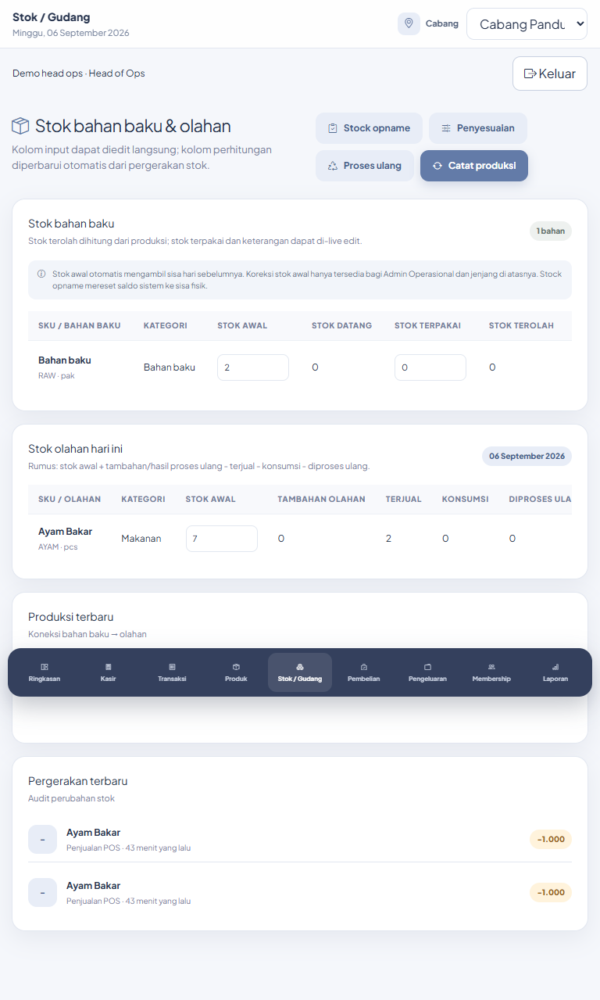

### Membaca dan mengedit tabel

1. Buka bagian bahan baku atau olahan. Periksa nama produk, satuan, stok awal, pergerakan, dan sisa. Tabel dapat digeser mendatar pada layar kecil.
2. Kolom Stok terpakai bahan baku serta Keterangan dapat diedit langsung. Tunggu indikator penyimpanan selesai setelah mengganti nilai.
3. Stok awal hanya dapat dikoreksi Developer, Superadmin, Head of Ops, atau Ops Admin. Kolom perhitungan lain mengikuti pergerakan, bukan diisi ulang secara manual.

### Produksi

1. Klik Catat produksi. Pilih bahan baku dan jumlah terolah.
2. Pilih menu hasil, masukkan tambahan olahan dan keterangan, lalu Simpan produksi.
3. Periksa bahan berkurang dan menu hasil bertambah. Jumlah bahan melebihi stok ditolak.

### Proses ulang

1. Klik Proses ulang. Pilih olahan sumber dan olahan tujuan yang berbeda.
2. Isi qty sumber, qty hasil, dan keterangan wajib; simpan.
3. Periksa pengurangan sumber dan penambahan hasil pada stok serta riwayat pergerakan.

### Penyesuaian dan konsumsi

1. Klik Penyesuaian dan pilih produk.
2. Pilih Tambah stok, Kurangi stok, atau Konsumsi owner/karyawan. Isi qty dan alasan.
3. Simpan, lalu periksa sisa stok dan pergerakan. Pengurangan yang membuat stok negatif ditolak.

### Opname akhir hari

1. Hitung sisa fisik per produk dan satuan.
2. Klik Stock opname, pilih produk, isi sisa fisik serta catatan, lalu simpan.
3. Saldo sistem disesuaikan ke jumlah fisik; selisih dicatat sebagai mutasi. Sisa olahan dibawa ke stok hari berikutnya.

Hasil: Stok bahan dan olahan berubah sesuai jenis aktivitas, dengan catatan pergerakan.

- Upload menu & stok lewat Excel dilakukan akun yang memiliki menu Produk (bawaan: Developer, Superadmin, Head of Ops, Ops Admin). Di cabang, jumlah stok dicatat lewat Stock opname.
- Catat pemakaian satu kali pada aktivitas yang sesuai. Bahan yang sudah berkurang melalui Produksi tidak perlu dikurangi lagi sebagai pemakaian manual untuk aktivitas yang sama.
- Gunakan catatan untuk menjelaskan selisih fisik atau koreksi.

## Pembelian

Mencatat bahan yang dibeli, penerimaan barang, pembayaran/DP, dan koreksi pembelian.

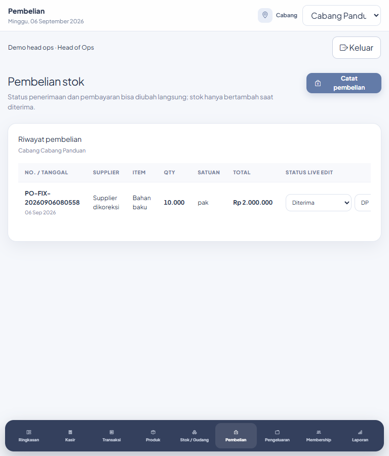

### Mencatat pembelian

1. Klik Catat pembelian. Isi supplier, bahan baku, qty, harga beli per satuan, dan tanggal.
2. Pilih Diterima jika barang sudah masuk; pilih Belum diterima jika masih dipesan/dikirim.
3. Pilih Lunas, DP, atau Belum dibayar. Untuk DP isi nominal yang sudah dibayar; tidak boleh melebihi total.
4. Isi catatan dan Simpan pembelian. Stok hanya bertambah ketika penerimaan berstatus Diterima.

### Mengubah status langsung

1. Pada riwayat, ubah status barang atau pembayaran di kolom Status live edit. Perubahan tersimpan otomatis.
2. Jika memilih DP, ketik nominal; saat pindah fokus nilai disimpan. Contoh 5000 ditampilkan 5.000 dan tersimpan Rp5.000.
3. Tunggu halaman selesai diperbarui dan periksa status serta nominal. Mengubah pembayaran tidak menerima stok untuk kedua kalinya.

### Mengoreksi data

1. Klik Koreksi. Periksa supplier, produk, qty, harga, status barang/pembayaran, DP, tanggal, dan catatan.
2. Ubah bagian yang diperlukan lalu Simpan perubahan. Harga dan DP dari catatan lama dipertahankan ketika tidak diubah.
3. Koreksi supplier/catatan/harga tidak mengubah jumlah stok. Koreksi qty produk yang sama menerapkan selisihnya saja.
4. Jika mengganti produk atau membatalkan penerimaan, stok lama harus cukup untuk dibalik. Koreksi yang menyebabkan stok negatif ditolak dan tidak disimpan.

Hasil: Pembelian dan status pembayaran tersimpan; stok mencerminkan penerimaan dan koreksi bersih.

- Pembelian mencatat barang dan status pembayaran. Jangan menganggap perubahan status ini melakukan transfer bank secara otomatis.
- Tidak ada aksi hapus pembelian pada menu saat ini; gunakan koreksi sesuai kejadian sebenarnya.

## Pengeluaran

Mencatat biaya operasional dan kanal pembayarannya agar rekap kas dan laporan sesuai.

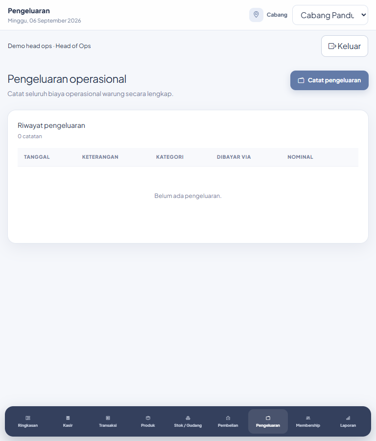

### Mencatat biaya

1. Klik Catat pengeluaran. Pilih kategori yang tersedia dan tanggal kejadian.
2. Isi keterangan, pilih Dibayar melalui, lalu masukkan nominal minimal Rp1.
3. Simpan dan periksa baris baru, tanggal, nominal, serta kanal pembayaran.
4. Pengeluaran Tunai memengaruhi rekonsiliasi kas tunai; pilih kanal sesuai pembayaran sebenarnya.

### Mengarsipkan catatan salah

1. Temukan catatan yang salah, klik Arsipkan, lalu konfirmasi.
2. Jika perlu pengganti, catat pengeluaran yang benar dengan keterangan yang jelas. Menu ini belum menyediakan edit atau pemulihan arsip.

Hasil: Pengeluaran masuk ke laporan cabang sesuai tanggal dan metode pembayaran.

- Pastikan tidak menggandakan catatan biaya yang sudah dimasukkan.

## Membership dan deposit

Mengaktifkan kartu, mengelola data member, menerima top up, dan mengoreksi deposit dengan otorisasi.

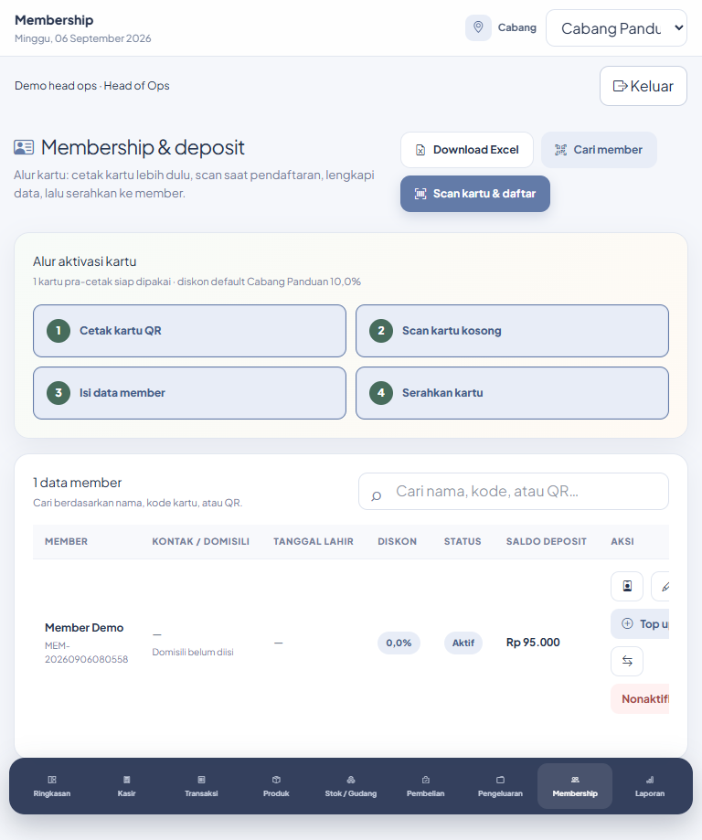

### Aktivasi kartu baru

1. Siapkan kartu pra-cetak dari Pengaturan; mintakan kepada admin jika akun tidak memiliki akses pembuatan kartu.
2. Klik Scan kartu & daftar. Scan QR atau masukkan kode kartu lalu Verifikasi.
3. Setelah kartu kosong ditemukan, isi nama lengkap, kontak, domisili, tanggal lahir, dan diskon sesuai kebutuhan.
4. Klik Aktifkan kartu & simpan member. Kartu terhubung ke member dan tidak tersedia lagi sebagai kartu kosong.

### Mencari dan memperbarui member

1. Masukkan nama/kode/QR pada pencarian lalu Enter, atau gunakan Cari member dan scan/manual kode.
2. Periksa identitas serta status sebelum transaksi. Gunakan ikon pensil untuk memperbarui data dan diskon.
3. Gunakan ikon kartu untuk membuka/cetak kartu; saldo tidak ditampilkan pada desain kartu.
4. Nonaktifkan jika member tidak boleh digunakan di kasir; Aktifkan untuk mengembalikannya.

### Top up

1. Pada member aktif, klik Top up. Periksa nama penerima.
2. Masukkan nominal minimal Rp1.000 dan metode penerimaan yang tersedia, kemudian simpan.
3. Periksa saldo baru. Saldo member dapat dipakai dari cabang lain dalam tenant yang sama.

### Koreksi deposit

1. Klik ikon koreksi (panah dua arah). Pilih tambah/kredit atau kurang/debit, nominal, dan alasan minimal lima karakter.
2. Akun non-supervisor harus memasukkan PIN Manager/SPV yang berwenang; pemegang otorisasi dapat menggunakan otorisasinya sendiri.
3. Simpan dan periksa saldo. Debit melebihi saldo ditolak; koreksi disimpan dengan catatan otorisasi.

### Ekspor

1. Klik Download Excel untuk mengunduh data member yang disediakan sistem. Simpan file sesuai pengelolaan data internal.

Hasil: Identitas, status dan saldo member tersedia sesuai tenant; aktivitas deposit tercatat.

- Pendaftaran membutuhkan kartu kosong terverifikasi. Kartu yang sudah dipakai tidak dapat diaktivasi ulang untuk orang lain.
- Gunakan Top up untuk penerimaan uang baru, dan Koreksi deposit untuk pembetulan beralasan.

## Laporan

Melihat hasil operasional berdasarkan periode, cabang, dan jenis laporan yang diizinkan.

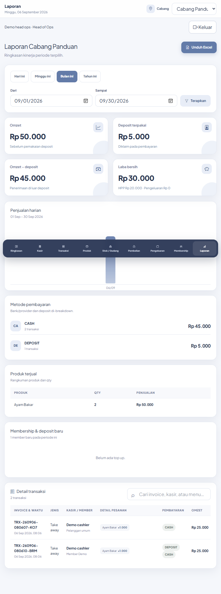

### Memilih cakupan dan periode

1. Pilih cabang tertentu atau Consolidated · Semua warung untuk laporan lintas cabang.
2. Pilih Hari ini, Minggu ini, Bulan ini, Tahun ini, atau isi Dari dan Sampai lalu terapkan periode custom.
3. Periksa judul cabang serta tanggal sebelum membaca omzet, HPP, pengeluaran, keuntungan, kanal pembayaran, dan rincian transaksi.

### Mengganti jenis laporan

1. Developer/Superadmin dapat memilih Laporan riil atau Non-riil. Head of Ops hanya memperoleh laporan riil pada akses bawaan.
2. Pergantian jenis mempertahankan tanggal Dari/Sampai yang dipilih. Non-riil mengikuti persentase yang dikonfigurasi pada masing-masing cabang.

### Ekspor dan rincian

1. Klik Unduh Excel. Ekspor mengikuti jenis dan periode yang sedang aktif.
2. Periksa rincian transaksi; cetak struk tersedia pada rincian riil sesuai akses.
3. Pencarian rincian pada halaman membantu menyaring baris yang sudah ditampilkan.

Hasil: Laporan dan file Excel mengikuti pilihan cabang, periode, serta hak akses akun.

- Jenis laporan non-riil tidak tersedia hanya karena seseorang mengetahui URL; akses juga diperiksa server.

## Menyambungkan printer struk

Menyiapkan dan memakai printer struk kasir: printer USB/Bluetooth lewat dialog cetak browser, atau printer Epson ePOS yang mencetak langsung lewat jaringan.

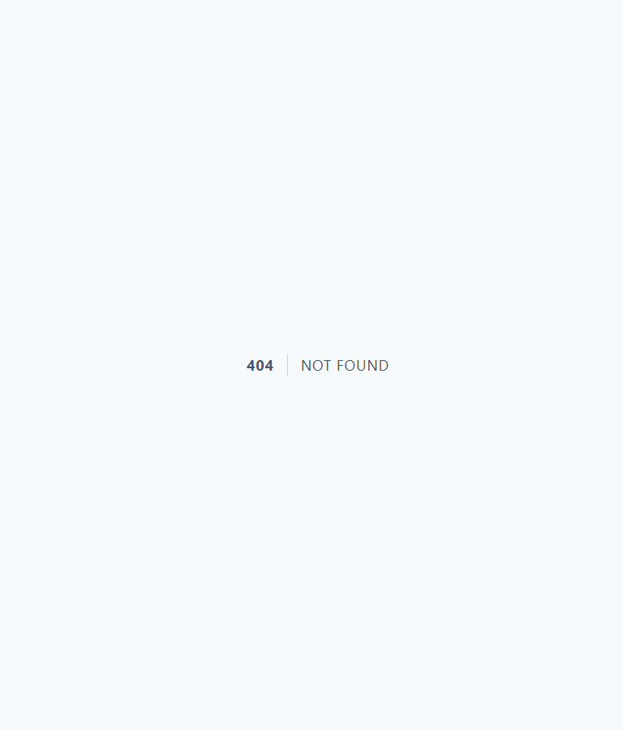

### Pilih cara cetak

1. Umum (dialog cetak browser): untuk printer thermal USB, Bluetooth, atau LAN yang sudah terpasang di komputer/tablet kasir. Setelah Bayar & cetak, halaman struk terbuka lalu dicetak lewat dialog cetak.
2. Epson ePOS (langsung via jaringan): untuk printer Epson yang mendukung ePOS-Print, seperti TM-m30, TM-T82III/X, dan TM-T88VI. Struk customer dan dapur tercetak otomatis tanpa dialog dan dapat membuka cash drawer.

### Printer USB/Bluetooth (cara Umum)

1. Pasang driver printer thermal di komputer kasir sesuai petunjuk produsen, lalu lakukan test page dari Windows. Untuk Bluetooth, pasangkan (pair) printer lebih dulu. Pada tablet Android, pasang aplikasi layanan cetak (print service) dari produsen printer agar printer muncul di Chrome.
2. Buat satu transaksi, lalu klik Bayar & cetak. Halaman struk terbuka di jendela baru; izinkan pop-up untuk alamat POS Warung bila browser memblokirnya.
3. Pilih Cetak customer + dapur, Cetak customer, atau Cetak dapur.
4. Pada dialog cetak pilih printer thermal, ukuran kertas 58 mm atau 80 mm sesuai gulungan, skala 100%, margin None/tidak ada, dan matikan Headers and footers. Chrome/Edge mengingat pilihan ini untuk cetak berikutnya.
5. Struk dapat dicetak ulang kapan saja dari menu Transaksi (ikon printer), tanpa membuat transaksi baru.

### Memakai printer di Kasir

1. Bila printer Epson ePOS aktif untuk cabang, nama printer tampil di samping tombol Tutup kasir. Bayar & cetak langsung mencetak struk customer dan lembar dapur.
2. Bila printer gagal (mati, kertas habis, beda jaringan), transaksi tetap tersimpan; aplikasi menampilkan pesan lalu membuka struk browser sebagai cadangan. Jangan mengulang pembayaran.
3. Halaman struk juga menyediakan tombol Cetak ke printer Epson untuk cetak ulang langsung.

### Jika printer tidak mencetak

1. Periksa daya, kertas, dan tutup printer; lampu error harus mati.
2. Pastikan perangkat kasir dan printer berada di jaringan yang sama dan IP printer tidak berubah (cetak status sheet printer untuk melihat IP).
3. Untuk https, buka ulang https://IP-printer dan terima sertifikatnya.
4. Untuk USB/Bluetooth, uji test page dari sistem operasi. Bila test page gagal, masalahnya ada di driver atau sambungan, bukan di aplikasi.
5. Hubungi Superadmin bila IP atau pengaturan printer perlu diubah; menu Pengaturan tidak tersedia untuk role Anda.

Hasil: Struk customer dan lembar dapur tercetak dari Kasir; cetak ulang tersedia di Transaksi.

- Kamera dan printer tetap perlu diuji di perangkat outlet; panduan ini tidak menggantikan uji fisik.

