# User guide Superadmin

Mengelola operasional, role, akun level bawah, dan konfigurasi. Pemeliharaan tersedia hanya selama belum ada akun Developer aktif dalam tenant.

Cabang: Seluruh cabang. Pemegang otorisasi: ya. Edit stok awal: ya.

Ikuti cabang akun; gunakan sidebar desktop atau navigasi bawah mobile. Tombol Keluar mobile berada pada baris akun di bawah header. Screenshot menggunakan data demo setelah perbaikan.

## Setup awal (wizard)

Menyiapkan usaha, cabang pertama, menu perdana, dan hak akses bawaan sebelum aplikasi dipakai berjualan. Wizard hanya tampil selama data awal belum lengkap.

Wizard aktif bila tenant belum ada, kolom setup_step tenant belum kosong, belum ada cabang aktif, atau belum ada role pada tenant. Selama itu seluruh URL lain dialihkan ke /setup dan permintaan JSON dijawab kode 409 beserta alamat pengalihan, sehingga tidak ada menu yang bisa dilewati.

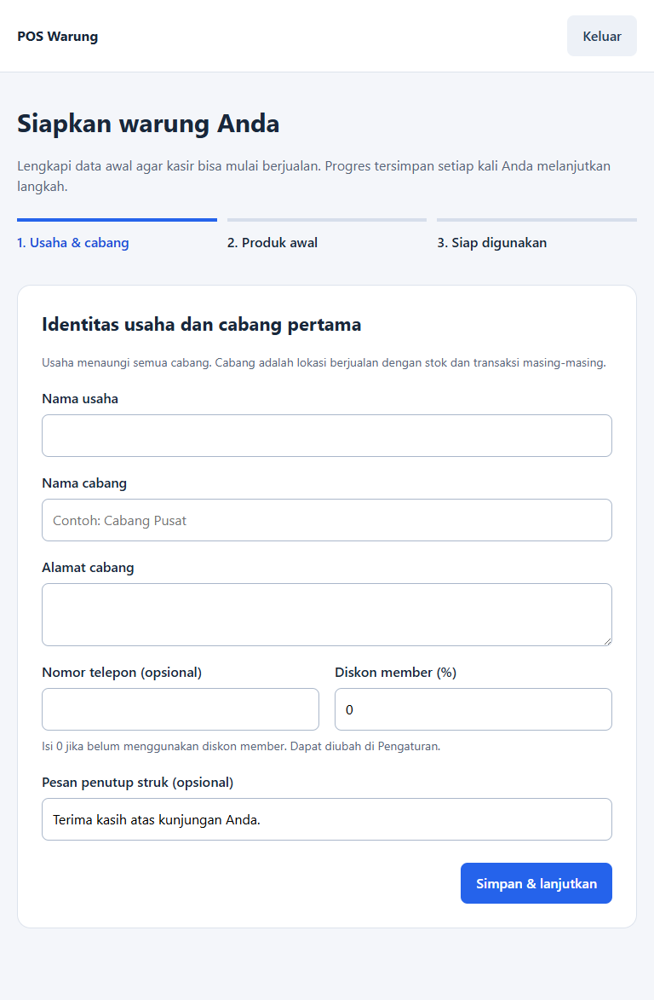
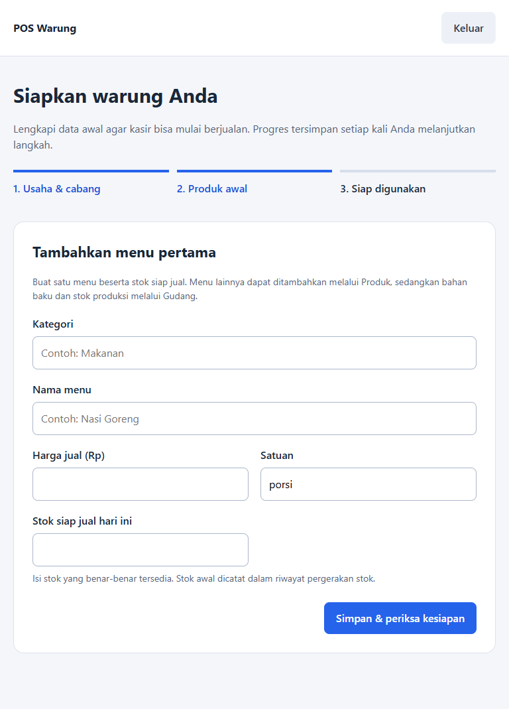
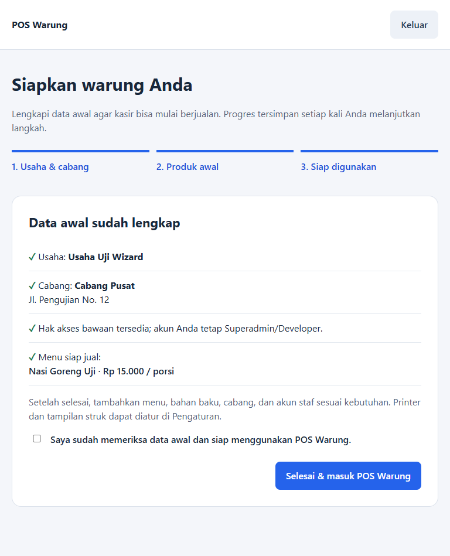

### Langkah 1 - Usaha dan cabang

1. Masuk memakai akun Developer atau Superadmin. Role lain hanya melihat halaman "Warung belum siap digunakan" dan permintaan simpannya ditolak 403.
2. Isi nama usaha. Nama ini menaungi seluruh cabang dan dipakai sebagai identitas usaha pada cabang pertama.
3. Isi nama cabang pertama beserta alamatnya. Nomor telepon boleh dikosongkan.
4. Isi diskon member 0 sampai 100 persen. Isi 0 bila belum memakai diskon member; nilainya dapat diubah kemudian melalui Pengaturan.
5. Isi pesan penutup struk bila perlu, lalu klik Simpan dan lanjutkan.
6. Sistem membuat usaha, cabang aktif pertama, dan tujuh role bawaan; akun Anda diikat ke cabang tersebut. Role bawaan yang pernah diarsipkan dipulihkan, sedangkan role yang sudah disesuaikan tidak ditimpa.

### Langkah 2 - Menu pertama

1. Isi kategori menu, misalnya Makanan. Kategori yang sudah ada dipakai ulang, dan kategori yang diarsipkan dipulihkan.
2. Isi nama menu, harga jual minimal Rp1, dan satuan seperti porsi atau gram.
3. Isi stok siap jual hari ini, minimal 0,001 dan maksimal tiga angka di belakang koma. Isi jumlah yang benar-benar tersedia.
4. Klik Simpan dan periksa kesiapan. Menu dibuat sebagai produk jenis menu dengan SKU otomatis berawalan MENU-, stok harian tercatat untuk tanggal hari ini, dan pergerakan stok masuk tersimpan dengan referensi SETUP.
5. Menu berikutnya, bahan baku, dan stok produksi tidak dimasukkan di sini. Tambahkan melalui Produk dan Gudang setelah setup selesai.

### Langkah 3 - Periksa dan selesaikan

1. Periksa rangkuman usaha, cabang, hak akses, dan daftar menu siap jual beserta harga dan satuannya.
2. Centang pernyataan kesiapan. Tanpa centang, sistem menolak dengan pesan agar pernyataan kesiapan dicentang lebih dulu.
3. Klik Selesai dan masuk POS Warung. Sistem memeriksa ulang bahwa ada menu aktif berharga di atas nol serta hak akses akun sudah terbaca sebelum setup ditutup.
4. Setelah setup ditutup, halaman /setup mengalihkan ke menu pertama akun Anda dan wizard tidak muncul lagi.

### Melanjutkan setup yang terputus

1. Progres tersimpan pada setiap langkah. Menutup browser atau keluar tidak mengulang dari awal; setelah masuk kembali wizard melanjutkan pada langkah terakhir.
2. Mengirim ulang formulir yang sama atau memakai tab lama tidak menggandakan data. Langkah yang sudah selesai diabaikan sistem.
3. Data tidak disimpan sebagian ketika ada isian yang salah. Perbaiki isian yang ditandai lalu simpan ulang.
4. Bila cabang aktif tidak ditemukan saat langkah 2, wizard kembali ke langkah 1 disertai pesan agar data usaha dan cabang dilengkapi lagi.

Hasil: Usaha, cabang pertama, tujuh role bawaan, satu menu siap jual, dan stok hari pertama tersimpan. Kolom setup_step dikosongkan sehingga seluruh menu sesuai hak akses terbuka dan kasir dapat mulai berjualan.

- Wizard hanya menyiapkan data minimum. Cabang tambahan, akun staf, bahan baku, perangkat, dan tampilan struk diatur setelahnya melalui Pengaturan, Produk, dan Gudang.
- Akun bukan Developer atau Superadmin tidak dapat menyelesaikan setup. Minta pengelola sistem menyelesaikannya lebih dulu, lalu masuk kembali.
- Pesan kesalahan wizard tampil dalam Bahasa Indonesia, misalnya Kolom nama usaha wajib diisi.

## Ringkasan

Memantau kondisi cabang hari ini melalui penjualan, rata-rata transaksi, pengeluaran, stok rendah, tren tujuh hari, dan transaksi terbaru.

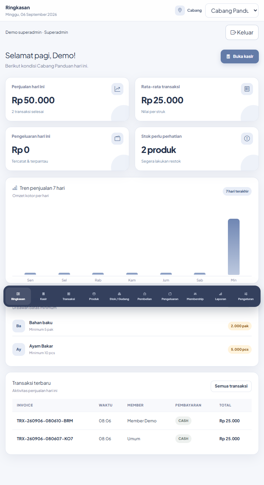

### Membaca ringkasan

1. Pilih cabang pada bagian atas; untuk rekap lintas cabang pilih Consolidated · Semua warung.
2. Baca kartu penjualan, rata-rata per transaksi, pengeluaran, dan stok perlu perhatian.
3. Lihat tren tujuh hari dan daftar transaksi terbaru.
4. Gunakan Lihat semua untuk menuju Gudang atau Semua transaksi untuk menuju riwayat, apabila akses menu tersebut tersedia.

### Menindaklanjuti stok rendah

1. Periksa produk dan satuannya pada Perhatian stok.
2. Buka Gudang untuk memeriksa stok fisik, produksi, atau penyesuaian yang perlu dicatat. Stok sisa hari sebelumnya tersedia otomatis saat halaman stok dibuka.

Hasil: Ringkasan menampilkan informasi periode hari ini sesuai cakupan cabang. Perubahan cabang tidak memindahkan data transaksi.

- Menu ini menampilkan omzet. Hak akses default hanya Developer, Superadmin, dan Head of Ops.

## Kasir dan tutup kasir

Mencatat pesanan, menerima pembayaran, melanjutkan open bill, mencetak struk, dan melakukan rekonsiliasi kas harian.

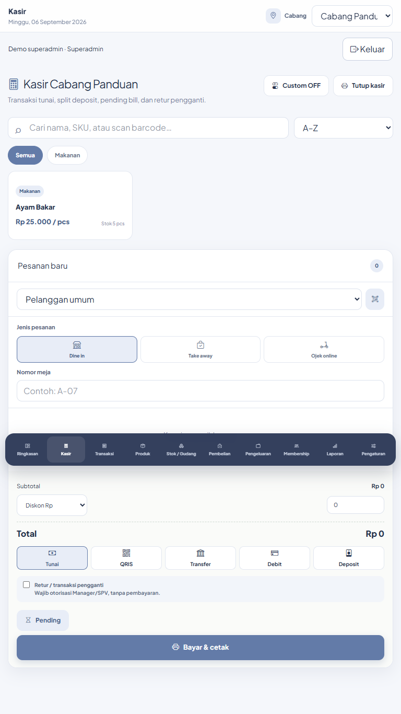

### Membuat pesanan

1. Pastikan nama cabang benar dan stok menu tersedia. Cari produk lewat nama, SKU/barcode, kategori, atau urutan harga/nama.
2. Klik produk untuk memasukkannya ke keranjang. Ubah jumlah pada kolom qty atau tombol +/−; periksa satuan pcs/gram.
3. Pilih Dine in dan isi nomor meja, Take away, atau Ojek online dan pilih platform. Harga online digunakan otomatis untuk pesanan online.
4. Pilih member dari daftar atau tombol scan jika diperlukan. Periksa nama, saldo, dan diskon sebelum meneruskan.
5. Periksa diskon Rp, diskon %, atau diskon member. Pastikan total dan jumlah produk benar.

### Membayar dan mencetak

1. Pilih Tunai, QRIS, Transfer, Debit, atau Deposit. Untuk QRIS/transfer/debit pilih bank atau provider penerima.
2. Tunai: masukkan uang yang benar-benar diterima. Contoh total Rp25.000, terima Rp30.000, maka kembalian Rp5.000. Input kosong atau kurang ditolak.
3. Deposit: pilih member. Anda dapat memakai seluruh tagihan atau sebagian saldo. Untuk split, isi deposit yang dipakai dan pilih kanal pelunasan; jika sisa dibayar tunai, isi nominal uang yang diterima.
4. Klik Bayar & cetak sekali. Tunggu proses selesai dan periksa struk. Stok berkurang dan saldo deposit terpakai dikurangi hanya ketika transaksi berhasil.
5. Jika struk belum tercetak, periksa Transaksi dan cetak ulang invoice yang sudah tersimpan sebelum membuat pesanan ulang.

### Menyimpan dan melanjutkan open bill

1. Susun pesanan lalu klik Pending. Bill tersimpan tanpa mengurangi stok.
2. Klik Open bill, pilih invoice, periksa lagi member, item, harga, dan stok.
3. Ubah pesanan lalu Pending untuk memperbarui bill yang sama; gunakan Bayar & cetak untuk menyelesaikannya.
4. Untuk membatalkan pending, gunakan tombol batal pada daftar Open bill dan isi alasan.

### Transaksi pengganti dan nominal custom

1. Retur/transaksi pengganti: centang opsi tersebut dan isi PIN Manager/SPV yang berwenang. Transaksi pengganti tidak menagih pembayaran, tetapi mengeluarkan stok barang pengganti.
2. Custom ON/OFF hanya dapat diatur oleh role pemegang otorisasi. Ketika diaktifkan, tombol Custom memungkinkan nama dan harga item manual yang tampil pada nota.

### Rekonsiliasi akhir hari

1. Klik Tutup kasir. Rekap berlaku untuk cabang dan tanggal hari ini.
2. Masukkan modal kas awal dan kas fisik yang dihitung; periksa penjualan tunai bersih, top up tunai, dan pengeluaran tunai.
3. Kas seharusnya = modal awal + penjualan tunai net + top up tunai − pengeluaran tunai. Isi catatan selisih/serah terima.
4. Jika akun bukan pemegang otorisasi, isi PIN Manager/SPV yang berwenang untuk cabang aktif. Klik Simpan tutup kasir dan periksa selisih.
5. Catatan tutup kasir yang sudah tersimpan hanya dapat diperbarui oleh pemegang otorisasi. Gunakan Cetak rekap bila diperlukan.

Hasil: Invoice selesai tercatat bersama pembayaran; struk customer dan salinan dapur tersedia. Tutup kasir menyimpan rekonsiliasi harian, bukan mengunci seluruh transaksi berikutnya.

- PIN hanya diterima dari akun aktif yang berwenang atas cabang tersebut.
- Kamera dan printer perlu dicoba di perangkat operasional; panduan ini tidak menggantikan uji fisik.

## Transaksi

Menelusuri invoice, mencetak ulang struk, dan membatalkan transaksi dengan jejak audit.

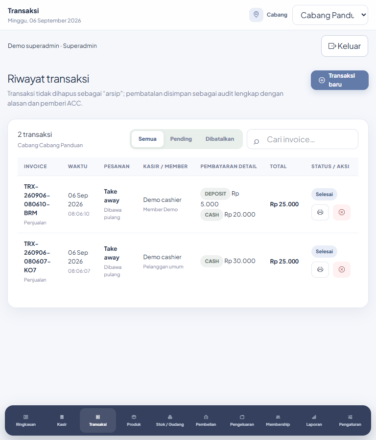

### Menemukan dan mencetak invoice

1. Buka Transaksi. Pilih Semua, Pending, atau Dibatalkan sesuai kebutuhan.
2. Cari invoice pada halaman aktif; gunakan paginasi untuk melihat catatan pada halaman lain. Pencarian di tabel ini memfilter baris halaman yang sedang ditampilkan.
3. Periksa waktu, pesanan, kasir/member, metode pembayaran, total, dan status.
4. Pada transaksi Selesai, klik ikon printer untuk membuka struk. Transaksi baru tersedia hanya jika akun juga memiliki menu Kasir.

### Membatalkan transaksi selesai

1. Klik ikon pembatalan pada invoice yang benar.
2. Isi alasan yang jelas, minimal lima karakter. Jika transaksi sudah lewat 30 detik, isi PIN Manager/SPV yang berwenang.
3. Konfirmasi pembatalan, lalu pastikan status menjadi Dibatalkan.
4. Periksa pemulihan stok dan deposit terkait. Invoice tetap tersimpan bersama alasan dan pemberi otorisasi. Pengembalian uang tunai/non-deposit di luar aplikasi tetap perlu diselesaikan secara operasional.

Hasil: Pembatalan mengubah status dan mencatat audit; transaksi tidak dihapus permanen.

- Untuk melanjutkan atau membatalkan bill Pending, gunakan Open bill di Kasir.
- Nominal pembayaran tunai pada riwayat dapat mencakup uang diterima sebelum kembalian; periksa struk untuk rincian kembalian.

## Produk dan kategori

Mengelola bahan baku, menu siap jual, harga, kategori, batas stok, serta arsip produk.

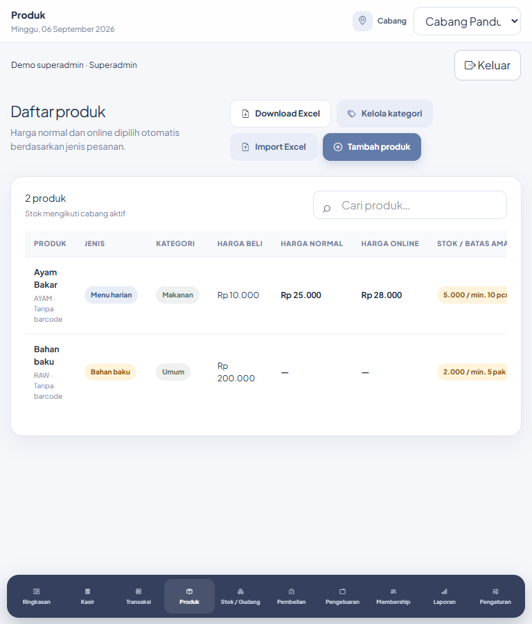

### Menambahkan produk

1. Klik Tambah produk. Isi nama dan jenis: menu siap jual memakai stok harian; bahan baku memakai stok gudang.
2. Isi SKU unik, barcode bila ada, kategori, dan satuan.
3. Masukkan harga beli, harga normal, harga online, stok awal, dan stok minimum; klik Simpan produk.
4. Periksa produk baru di tabel dan cabang aktif. Produk menu digunakan Kasir; bahan baku digunakan Pembelian/Produksi.

### Mengubah dan mengarsipkan

1. Gunakan ikon pensil untuk memperbarui data/harga produk; periksa kembali nilai sebelum Simpan perubahan.
2. Gunakan aksi arsip bila produk tidak dipakai. Produk arsip tidak tersedia sebagai produk aktif.
3. Untuk mengembalikan produk, cari bagian Arsip yang dapat dipulihkan lalu gunakan Pulihkan.

### Mengelola kategori

1. Klik Kelola kategori, isi nama dan warna, lalu Tambah kategori.
2. Perbarui nama/warna kategori pada tabel dan klik Simpan.
3. Kategori yang masih dipakai produk aktif tidak dapat diarsipkan. Pindahkan produk ke kategori lain sebelum mengarsipkannya.

### Impor dan ekspor

1. Klik Download Excel untuk memperoleh data sekaligus template kolom.
2. Siapkan file sesuai kolom SKU, Barcode, Nama, Jenis, Kategori, Satuan, Harga Beli, Harga Normal, Harga Online, dan Stok Minimum. Nilai Jenis menggunakan menu atau ingredient.
3. Klik Import Excel, pilih file .xlsx/.xls/.csv maksimal 5 MB, lalu Import & perbarui. SKU yang sudah ada diperbarui; SKU baru dibuat.
4. Periksa kembali hasil, harga, jenis produk, dan stok setelah impor. Jangan gunakan impor untuk menggantikan pencatatan mutasi stok harian.

Hasil: Master produk diperbarui. Penyesuaian stok operasional selanjutnya dicatat di Gudang.

- Pencarian daftar Produk hanya memfilter halaman aktif; gunakan paginasi untuk halaman lainnya.
- Produk berlaku dalam tenant, sementara stok mengikuti cabang.

## Stok / Gudang

Mencatat pemakaian bahan, produksi, konsumsi, proses ulang, penyesuaian, serta opname.

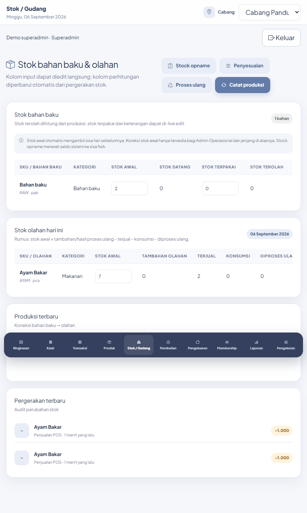

### Membaca dan mengedit tabel

1. Buka bagian bahan baku atau olahan. Periksa nama produk, satuan, stok awal, pergerakan, dan sisa. Tabel dapat digeser mendatar pada layar kecil.
2. Kolom Stok terpakai bahan baku serta Keterangan dapat diedit langsung. Tunggu indikator penyimpanan selesai setelah mengganti nilai.
3. Stok awal hanya dapat dikoreksi Developer, Superadmin, Head of Ops, atau Ops Admin. Kolom perhitungan lain mengikuti pergerakan, bukan diisi ulang secara manual.

### Produksi

1. Klik Catat produksi. Pilih bahan baku dan jumlah terolah.
2. Pilih menu hasil, masukkan tambahan olahan dan keterangan, lalu Simpan produksi.
3. Periksa bahan berkurang dan menu hasil bertambah. Jumlah bahan melebihi stok ditolak.

### Proses ulang

1. Klik Proses ulang. Pilih olahan sumber dan olahan tujuan yang berbeda.
2. Isi qty sumber, qty hasil, dan keterangan wajib; simpan.
3. Periksa pengurangan sumber dan penambahan hasil pada stok serta riwayat pergerakan.

### Penyesuaian dan konsumsi

1. Klik Penyesuaian dan pilih produk.
2. Pilih Tambah stok, Kurangi stok, atau Konsumsi owner/karyawan. Isi qty dan alasan.
3. Simpan, lalu periksa sisa stok dan pergerakan. Pengurangan yang membuat stok negatif ditolak.

### Opname akhir hari

1. Hitung sisa fisik per produk dan satuan.
2. Klik Stock opname, pilih produk, isi sisa fisik serta catatan, lalu simpan.
3. Saldo sistem disesuaikan ke jumlah fisik; selisih dicatat sebagai mutasi. Sisa olahan dibawa ke stok hari berikutnya.

Hasil: Stok bahan dan olahan berubah sesuai jenis aktivitas, dengan catatan pergerakan.

- Catat pemakaian satu kali pada aktivitas yang sesuai. Bahan yang sudah berkurang melalui Produksi tidak perlu dikurangi lagi sebagai pemakaian manual untuk aktivitas yang sama.
- Gunakan catatan untuk menjelaskan selisih fisik atau koreksi.

## Pembelian

Mencatat bahan yang dibeli, penerimaan barang, pembayaran/DP, dan koreksi pembelian.

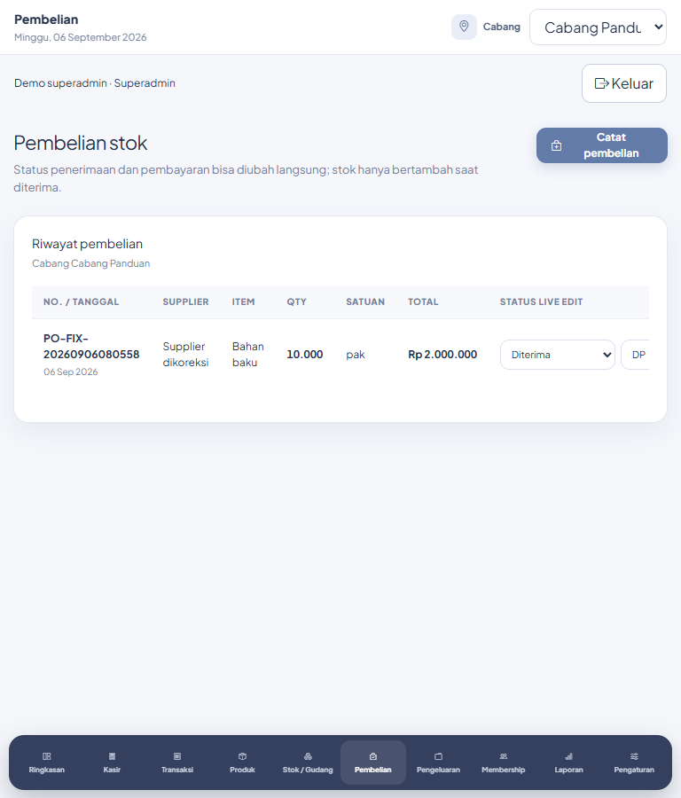

### Mencatat pembelian

1. Klik Catat pembelian. Isi supplier, bahan baku, qty, harga beli per satuan, dan tanggal.
2. Pilih Diterima jika barang sudah masuk; pilih Belum diterima jika masih dipesan/dikirim.
3. Pilih Lunas, DP, atau Belum dibayar. Untuk DP isi nominal yang sudah dibayar; tidak boleh melebihi total.
4. Isi catatan dan Simpan pembelian. Stok hanya bertambah ketika penerimaan berstatus Diterima.

### Mengubah status langsung

1. Pada riwayat, ubah status barang atau pembayaran di kolom Status live edit. Perubahan tersimpan otomatis.
2. Jika memilih DP, ketik nominal; saat pindah fokus nilai disimpan. Contoh 5000 ditampilkan 5.000 dan tersimpan Rp5.000.
3. Tunggu halaman selesai diperbarui dan periksa status serta nominal. Mengubah pembayaran tidak menerima stok untuk kedua kalinya.

### Mengoreksi data

1. Klik Koreksi. Periksa supplier, produk, qty, harga, status barang/pembayaran, DP, tanggal, dan catatan.
2. Ubah bagian yang diperlukan lalu Simpan perubahan. Harga dan DP dari catatan lama dipertahankan ketika tidak diubah.
3. Koreksi supplier/catatan/harga tidak mengubah jumlah stok. Koreksi qty produk yang sama menerapkan selisihnya saja.
4. Jika mengganti produk atau membatalkan penerimaan, stok lama harus cukup untuk dibalik. Koreksi yang menyebabkan stok negatif ditolak dan tidak disimpan.

Hasil: Pembelian dan status pembayaran tersimpan; stok mencerminkan penerimaan dan koreksi bersih.

- Pembelian mencatat barang dan status pembayaran. Jangan menganggap perubahan status ini melakukan transfer bank secara otomatis.
- Tidak ada aksi hapus pembelian pada menu saat ini; gunakan koreksi sesuai kejadian sebenarnya.

## Pengeluaran

Mencatat biaya operasional dan kanal pembayarannya agar rekap kas dan laporan sesuai.

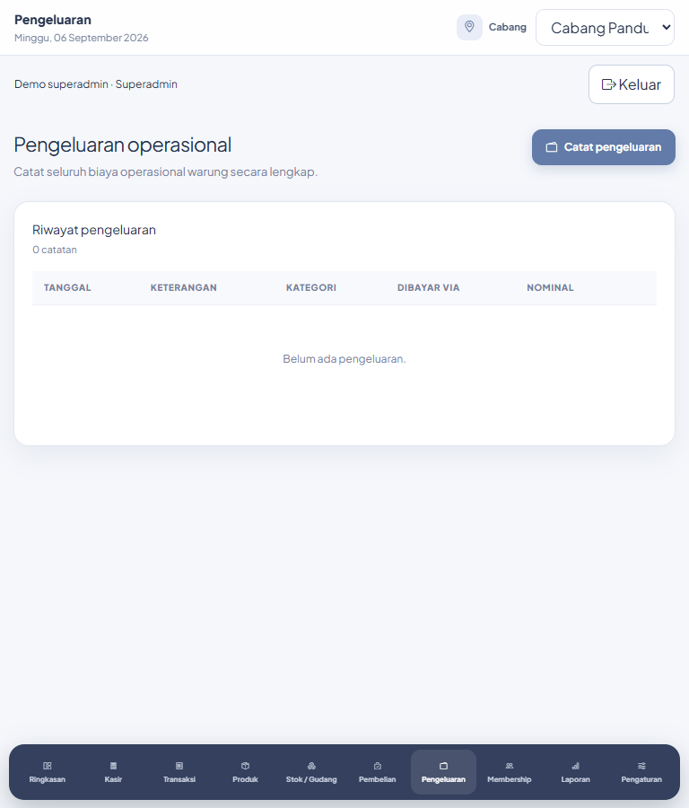

### Mencatat biaya

1. Klik Catat pengeluaran. Pilih kategori yang tersedia dan tanggal kejadian.
2. Isi keterangan, pilih Dibayar melalui, lalu masukkan nominal minimal Rp1.
3. Simpan dan periksa baris baru, tanggal, nominal, serta kanal pembayaran.
4. Pengeluaran Tunai memengaruhi rekonsiliasi kas tunai; pilih kanal sesuai pembayaran sebenarnya.

### Mengarsipkan catatan salah

1. Temukan catatan yang salah, klik Arsipkan, lalu konfirmasi.
2. Jika perlu pengganti, catat pengeluaran yang benar dengan keterangan yang jelas. Menu ini belum menyediakan edit atau pemulihan arsip.

Hasil: Pengeluaran masuk ke laporan cabang sesuai tanggal dan metode pembayaran.

- Pastikan tidak menggandakan catatan biaya yang sudah dimasukkan.

## Membership dan deposit

Mengaktifkan kartu, mengelola data member, menerima top up, dan mengoreksi deposit dengan otorisasi.

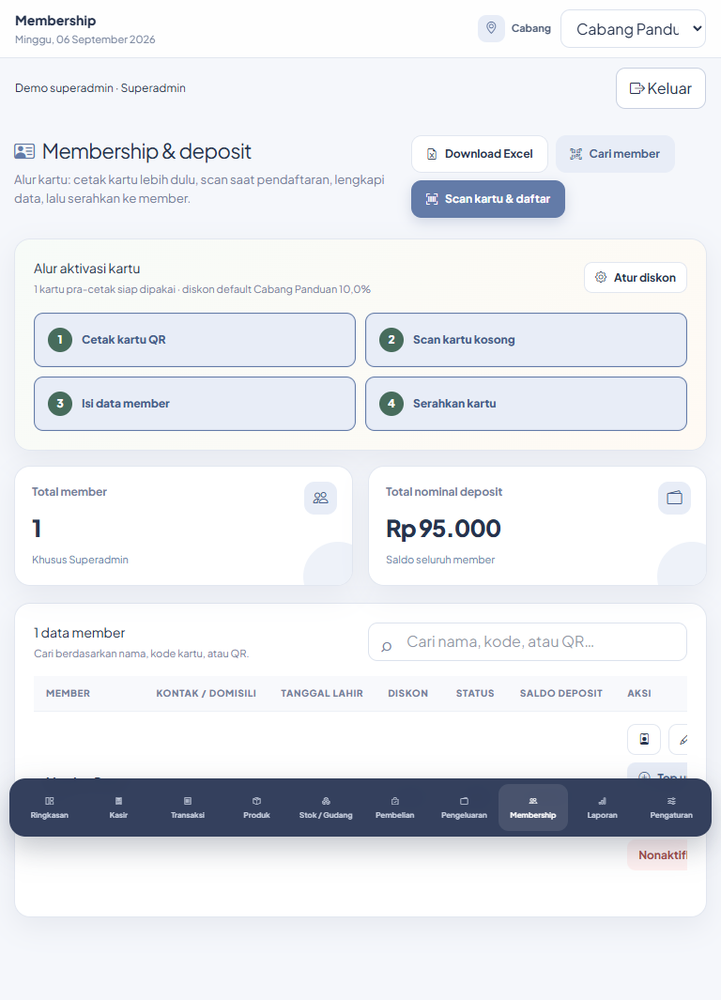

### Aktivasi kartu baru

1. Siapkan kartu pra-cetak dari Pengaturan; mintakan kepada admin jika akun tidak memiliki akses pembuatan kartu.
2. Klik Scan kartu & daftar. Scan QR atau masukkan kode kartu lalu Verifikasi.
3. Setelah kartu kosong ditemukan, isi nama lengkap, kontak, domisili, tanggal lahir, dan diskon sesuai kebutuhan.
4. Klik Aktifkan kartu & simpan member. Kartu terhubung ke member dan tidak tersedia lagi sebagai kartu kosong.

### Mencari dan memperbarui member

1. Masukkan nama/kode/QR pada pencarian lalu Enter, atau gunakan Cari member dan scan/manual kode.
2. Periksa identitas serta status sebelum transaksi. Gunakan ikon pensil untuk memperbarui data dan diskon.
3. Gunakan ikon kartu untuk membuka/cetak kartu; saldo tidak ditampilkan pada desain kartu.
4. Nonaktifkan jika member tidak boleh digunakan di kasir; Aktifkan untuk mengembalikannya.

### Top up

1. Pada member aktif, klik Top up. Periksa nama penerima.
2. Masukkan nominal minimal Rp1.000 dan metode penerimaan yang tersedia, kemudian simpan.
3. Periksa saldo baru. Saldo member dapat dipakai dari cabang lain dalam tenant yang sama.

### Koreksi deposit

1. Klik ikon koreksi (panah dua arah). Pilih tambah/kredit atau kurang/debit, nominal, dan alasan minimal lima karakter.
2. Akun non-supervisor harus memasukkan PIN Manager/SPV yang berwenang; pemegang otorisasi dapat menggunakan otorisasinya sendiri.
3. Simpan dan periksa saldo. Debit melebihi saldo ditolak; koreksi disimpan dengan catatan otorisasi.

### Ekspor

1. Klik Download Excel untuk mengunduh data member yang disediakan sistem. Simpan file sesuai pengelolaan data internal.

Hasil: Identitas, status dan saldo member tersedia sesuai tenant; aktivitas deposit tercatat.

- Pendaftaran membutuhkan kartu kosong terverifikasi. Kartu yang sudah dipakai tidak dapat diaktivasi ulang untuk orang lain.
- Gunakan Top up untuk penerimaan uang baru, dan Koreksi deposit untuk pembetulan beralasan.

## Laporan

Melihat hasil operasional berdasarkan periode, cabang, dan jenis laporan yang diizinkan.

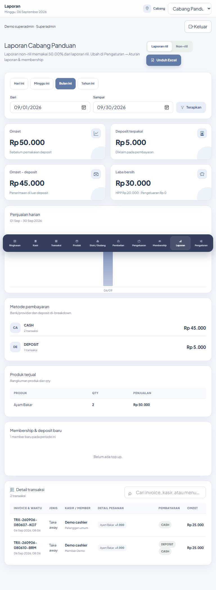

### Memilih cakupan dan periode

1. Pilih cabang tertentu atau Consolidated · Semua warung untuk laporan lintas cabang.
2. Pilih Hari ini, Minggu ini, Bulan ini, Tahun ini, atau isi Dari dan Sampai lalu terapkan periode custom.
3. Periksa judul cabang serta tanggal sebelum membaca omzet, HPP, pengeluaran, keuntungan, kanal pembayaran, dan rincian transaksi.

### Mengganti jenis laporan

1. Developer/Superadmin dapat memilih Laporan riil atau Non-riil. Head of Ops hanya memperoleh laporan riil pada akses bawaan.
2. Pergantian jenis mempertahankan tanggal Dari/Sampai yang dipilih. Non-riil mengikuti persentase yang dikonfigurasi pada masing-masing cabang.

### Ekspor dan rincian

1. Klik Unduh Excel. Ekspor mengikuti jenis dan periode yang sedang aktif.
2. Periksa rincian transaksi; cetak struk tersedia pada rincian riil sesuai akses.
3. Pencarian rincian pada halaman membantu menyaring baris yang sudah ditampilkan.

Hasil: Laporan dan file Excel mengikuti pilihan cabang, periode, serta hak akses akun.

- Jenis laporan non-riil tidak tersedia hanya karena seseorang mengetahui URL; akses juga diperiksa server.

## Pengaturan

Mengatur aturan cabang, identitas, struk, perangkat, kartu, role, akun, dan pemeliharaan.

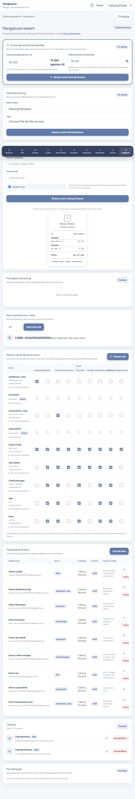

### Aturan laporan dan membership

1. Pilih cabang konkret yang hendak diatur dan periksa label cabang pada form.
2. Isi persentase laporan non-riil serta diskon default member baru, lalu Simpan untuk cabang tersebut.
3. Diskon pada member yang sudah ada diperiksa/diedit melalui Membership; jangan menganggap perubahan default otomatis mengganti seluruh member lama.

### Identitas dan struk

1. Pada Identitas warung, isi nama usaha dan pilih logo bila perlu; simpan.
2. Pada Tampilan struk, isi header tambahan, footer, dan pilihan tampilkan logo; lihat preview dan simpan.
3. Struk mengelompokkan item berdasarkan kategori dan menyediakan salinan dapur tanpa harga. Uji cetak dengan perangkat outlet setelah konfigurasi.

### Perangkat

1. Klik Tambah pada Perangkat terhubung. Isi nama, jenis, cabang, dan koneksi/alamat, lalu simpan.
2. Cek konfigurasi mencatat pengecekan data konfigurasi. Lakukan uji cetak/scan fisik dari komputer atau perangkat kasir.
3. Gunakan aksi hapus untuk menghapus registrasi perangkat yang tidak dipakai sesuai cakupan akses.

### Kartu member pra-cetak

1. Isi jumlah 1–100 lalu Buat batch QR.
2. Klik kode kartu untuk membuka kartu, lalu Cetak kartu.
3. Sediakan kartu kepada petugas pendaftaran; aktivasi orangnya dilakukan melalui Membership.

### Master role dan hak akses

1. Pada matriks role, centang menu yang boleh diakses. Buka Sub-akses Pengaturan jika role diberi menu Pengaturan.
2. Atur izin Non-riil dan pemegang PIN otorisasi bila diperlukan, lalu Simpan baris role. Perubahan berlaku pada permintaan berikutnya.
3. Tambah role untuk kombinasi baru; isi nama, kode huruf kecil/angka/garis bawah, minimal satu menu, dan sub-akses yang dibutuhkan.
4. Role sistem Developer/Superadmin terkunci. Role yang masih dipakai akun tidak dapat dihapus. Akses lintas cabang tidak tersedia sebagai centang pada form role biasa.

### Akun dan PIN

1. Klik Tambah akun, isi nama, email, role yang tersedia, cabang aktif, dan password minimal delapan karakter; simpan.
2. Gunakan ikon pensil untuk mengubah akun non-sistem. Password/PIN baru dapat dikosongkan jika tidak diganti.
3. Atur PIN otorisasi 4–8 digit pada akun pemegang otorisasi melalui ikon kunci.
4. Nonaktifkan akun yang tidak bertugas atau Pulihkan bila perlu. Anda tidak dapat menonaktifkan akun sendiri; Superadmin tidak dapat mengelola akun Developer seperti akun level bawah.

### Cabang

1. Klik Tambah, isi nama, kode, telepon, dan alamat; simpan.
2. Gunakan ikon pensil untuk mengoreksi data cabang.
3. Sebelum menonaktifkan cabang, pindahkan/nonaktifkan pengguna aktifnya. Cabang aktif terakhir tidak dapat dinonaktifkan.

### Pemeliharaan

1. Developer dapat memilih Migrasi database, Bersihkan cache, atau Hubungkan storage lalu Jalankan sesuai kebutuhan pemeliharaan.
2. Superadmin memperoleh akses transisi hanya ketika belum ada akun Developer aktif. Baca keluaran proses untuk memastikan hasilnya.

Hasil: Konfigurasi cabang dan master akses tersimpan sesuai kewenangan. Role khusus hanya melihat form yang sub-izinnya diberikan.

- Pembuatan akun biasa tidak menyediakan penugasan role sistem Developer/Superadmin.
- Setiap kartu/form Simpan berlaku pada bagiannya sendiri; tidak ada satu tombol Simpan untuk seluruh halaman.

